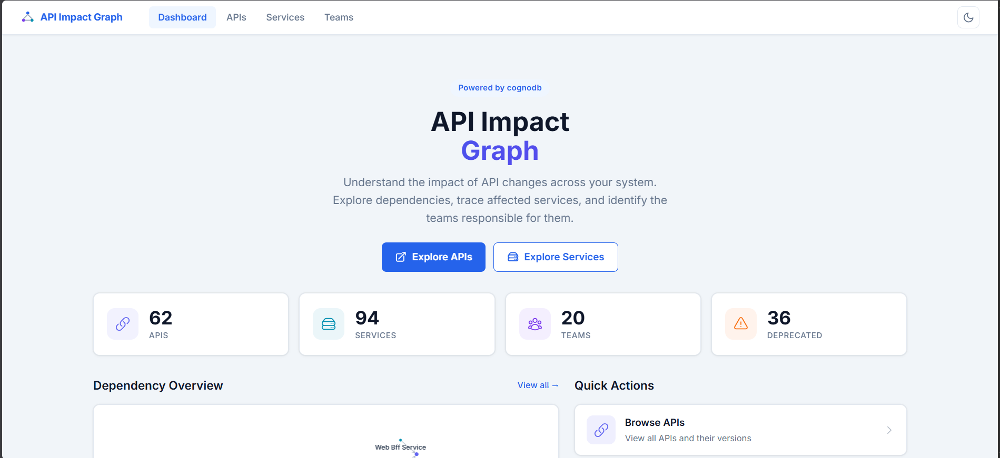
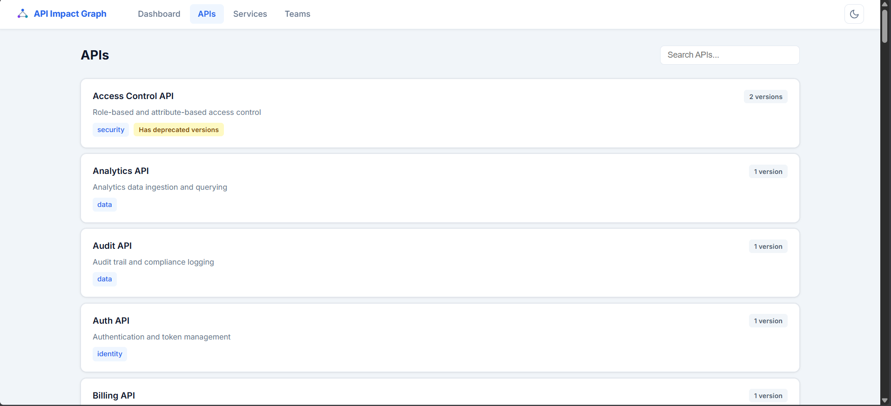
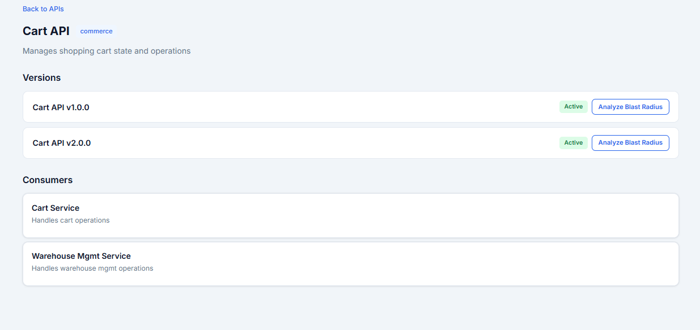
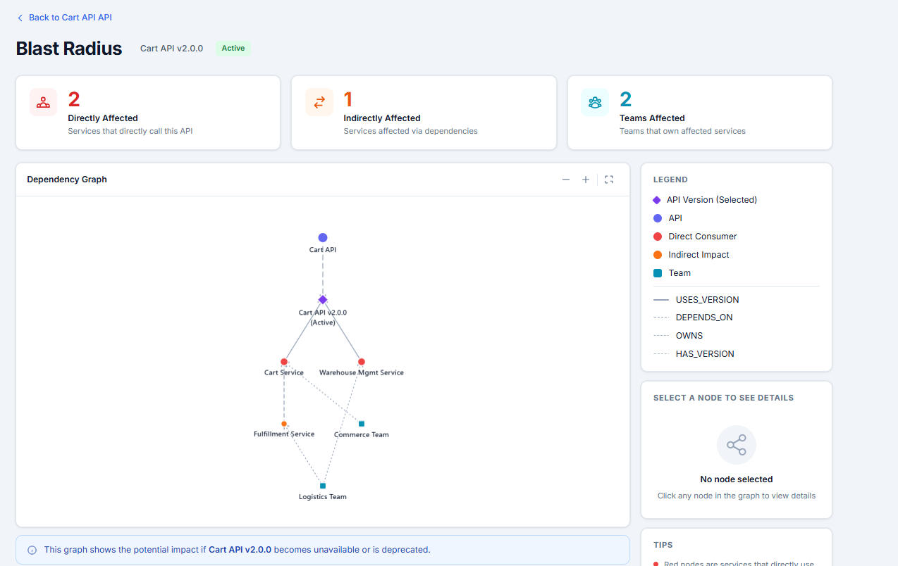
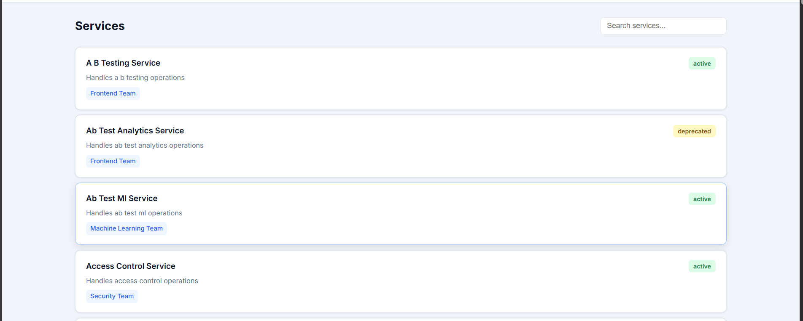
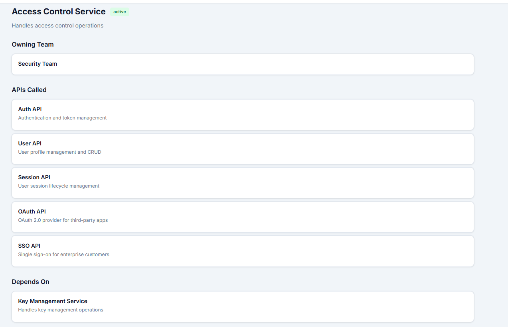
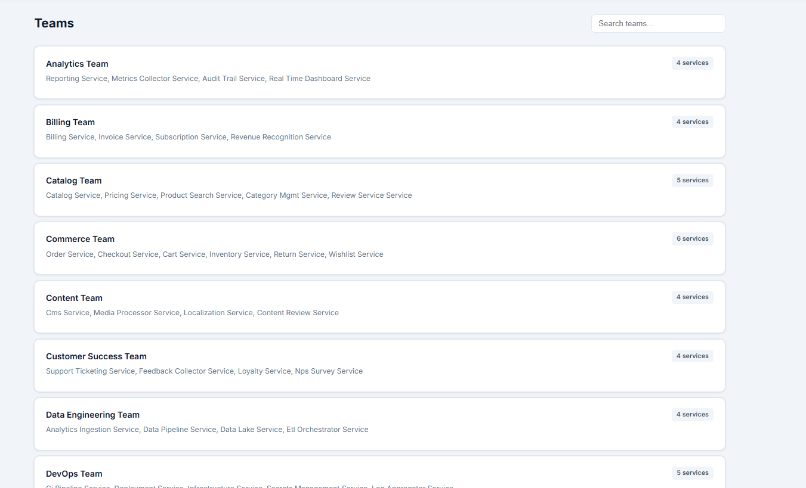
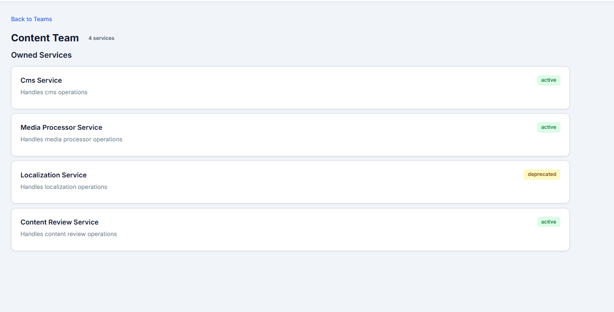

# API Impact Graph

A full-stack web application that models APIs, services, teams, and their dependencies as a graph, enabling engineers to explore blast radius, dependency chains, and team ownership when an API or service changes.

---

## Use Case

In a microservices architecture, a single API change can cascade across dozens of services. Today, answering *"If I deprecate the Payment API, which services break? Which teams are affected?"* requires manually tracing dependency chains across documentation and tribal knowledge.

API Impact Graph solves this by storing APIs, services, teams, and dependencies as a graph. Users can instantly trace blast radius, identify affected teams, and make informed decisions about API changes.

---

## Why a Graph Database?

The core questions are relationship-oriented: *"What depends on this API?"* and *"Which teams are affected?"* These require **multi-hop traversal** over a dependency network — finding all services affected through chains of dependencies, not just direct callers.

A relational database would require recursive CTEs or multiple self-joins that degrade exponentially with depth. A graph database traverses edges natively — a 4-hop dependency chain is a single Cypher query:

```cypher
MATCH (affected:Service)-[:DEPENDS_ON*1..4]->(origin:Service {id: $id})
RETURN DISTINCT affected
```

**cognodb** is used as the graph database, accessed via the official Neo4j Bolt driver using openCypher.

---

## Data Model

### Node Types

| Node | Properties | Purpose |
|---|---|---|
| **Team** | id, name | Engineering team |
| **Service** | id, name, description, status | Software service |
| **API** | id, name, description, domain | Logical API |
| **APIVersion** | id, version, status, releaseDate | Concrete API version |

### Relationships

```
Team ──OWNS──► Service ──CALLS──► API ──HAS_VERSION──► APIVersion
                  │                                      │
                  │ DEPENDS_ON                        REPLACED_BY
                  ▼                                      ▼
              Service                               APIVersion
```

| Relationship | Direction | Meaning |
|---|---|---|
| `OWNS` | Team → Service | Team is responsible for this service |
| `CALLS` | Service → API | Service consumes this API |
| `USES_VERSION` | Service → APIVersion | Service uses a specific version |
| `DEPENDS_ON` | Service → Service | Service depends on another service |
| `HAS_VERSION` | API → APIVersion | API has this version |
| `REPLACED_BY` | APIVersion → APIVersion | Deprecated version replaced by newer |

**Blast radius semantics:** `A -[:DEPENDS_ON]-> B` means A depends on B. If B fails, A is affected. Blast-radius traversal follows incoming `USES_VERSION` edges to find direct consumers, then incoming `DEPENDS_ON` edges up to 4 hops for indirect dependents.

---

## Setup and Run

### Prerequisites

- Node.js >= 18
- A cognodb instance (see below)

### Creating a cognodb Instance

1. Go to [cognodb.com](https://cognodb.com) and create an account
2. Create a new database instance
3. Copy the **Bolt URI**, **username**, and **password** from the connection details
4. These go into `server/.env`

### Environment

```bash
cp .env.example server/.env
```

Edit `server/.env`:

| Variable | Description | Example |
|---|---|---|
| `COGNODB_URI` | Bolt connection URI | `bolt+s://db-xxx.databases.cognodb.com` |
| `COGNODB_USERNAME` | Database username | `cognodb` |
| `COGNODB_PASSWORD` | Database password | (your password) |

### Seed Data

```bash
cd server
node seed/seed.js
```

Creates 20 teams, 94 services, 70+ APIs, 112 API versions, and 789 relationships. Idempotent — safe to re-run.

### Run

**Backend** (port 3001):
```bash
cd server && npm install && npm run dev
```

**Frontend** (port 5173, proxies /api to :3001):
```bash
cd client && npm install && npm run dev
```

**Production build:**
```bash
cd client && npm run build   # outputs to client/dist/
cd ../server && npm start     # serves API + static files
```

---

## Main Queries Explained

### Q-04: Blast Radius

The core query. Given an API version, finds all directly and indirectly affected services:

```cypher
-- Direct consumers
MATCH (av:APIVersion {id: $versionId})<-[:USES_VERSION]-(direct:Service)
-- Indirect dependents (1-4 hops)
OPTIONAL MATCH (indirect:Service)-[:DEPENDS_ON*1..4]->(direct)
-- Resolve team ownership
WITH collect(DISTINCT direct) + collect(DISTINCT indirect) AS allServices
UNWIND allServices AS svc
OPTIONAL MATCH (t:Team)-[:OWNS]->(svc)
RETURN collect(DISTINCT svc) AS services, collect(DISTINCT t) AS teams
```

### Q-03: Multi-Hop Dependencies

Finds all services that would break if a given service fails:

```cypher
MATCH (affected:Service)-[:DEPENDS_ON*1..4]->(origin:Service {id: $id})
RETURN DISTINCT affected
```

### Q-05: Dependency Path

Finds the shortest path between any two entities (workaround — cognodb doesn't support `shortestPath()`):

```cypher
MATCH path = (source {id: $sourceId})-[:DEPENDS_ON|CALLS|USES_VERSION|HAS_VERSION|REPLACED_BY*1..4]->(target {id: $targetId})
RETURN path LIMIT 10
```

The service layer selects the shortest from candidate paths in Node.js.

### Q-08: Dashboard Aggregates

Counts across all entity types:

```cypher
OPTIONAL MATCH (a:API) WITH count(a) AS apiCount
OPTIONAL MATCH (s:Service) WITH apiCount, count(s) AS serviceCount
OPTIONAL MATCH (t:Team) WITH apiCount, serviceCount, count(t) AS teamCount
OPTIONAL MATCH (av:APIVersion {status: 'deprecated'})
RETURN apiCount, serviceCount, teamCount, count(av) AS deprecatedCount
```

---

## Screenshots

### Dashboard


### APIs List


### API Detail


### Blast Radius Graph


### Services List


### Service Detail


### Teams List


### Team Detail


---

## Documentation

| File | Topic |
|---|---|
| `1000` | Problem statement |
| `1100` | Requirements |
| `1200` | Implementation plan |
| `1300` | cognodb compatibility |
| `1400` | Architecture |
| `1500` | Graph data model |
| `1600` | Cypher queries |
| `1700` | REST API |
| `1800` | API browsing pages |
| `1900` | Blast radius visualization |
| `2000` | Graph visualization redesign |
| `2100` | Blast radius redesign |
| `2200` | Service & team pages |
| `2300` | Dashboard (learning log) |
| `2400` | Dark mode & responsive (learning log) |
| `2500` | Seed data design (learning log) |
| `2600` | Error handling (learning log) |
| `2700` | Deployment guide (learning log) |
| `2800` | Fullscreen & drawer UI (learning log) |
